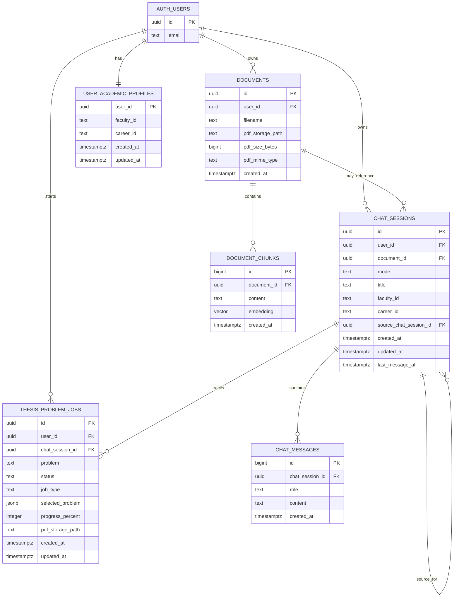

# Diccionario de datos - Asesor IA de Tesis

Fecha de elaboracion: 2026-07-07

## 1. Proposito del documento

Este documento describe el modelo de datos usado por el proyecto **Asesor IA de Tesis**, una aplicacion web con frontend en Next.js, backend en FastAPI y persistencia en Supabase. Su objetivo es explicar de forma clara que informacion se guarda, para que sirve cada tabla, como se relacionan las entidades y que reglas de integridad o seguridad aplican.

Fuentes revisadas:

- `backend/sql/schema.sql`
- `backend/app/models/schemas.py`
- `backend/app/database/supabase_repository.py`
- `backend/app/core/academic_catalog.py`
- `backend/app/routers/`
- `backend/app/core/config.py`

## 2. Alcance del modelo

El sistema almacena informacion para estos procesos principales:

1. Autenticacion de usuarios mediante Supabase Auth.
2. Registro del perfil academico del estudiante, compuesto por facultad y carrera.
3. Carga de documentos PDF de tesis.
4. Extraccion de texto, fragmentacion y almacenamiento vectorial para RAG.
5. Chats asociados a documentos PDF, revisiones de tesis, planes de tesis y tesis completas.
6. Generacion automatica de planes de tesis y tesis, con control de progreso y metadatos de PDF generado.
7. Almacenamiento de PDFs en Supabase Storage.

El esquema propio de la aplicacion se crea en el schema `public`. Supabase tambien aporta entidades externas como `auth.users`, `storage.buckets` y `storage.objects`.

## 3. Vista general de entidades

| Entidad | Tipo | Proposito |
| --- | --- | --- |
| `auth.users` | Tabla externa Supabase | Gestiona usuarios autenticados. No se crea en el script del proyecto, pero sus `id` son usados como FK. |
| `public.documents` | Tabla propia | Registra cada PDF subido por un usuario y sus metadatos de almacenamiento. |
| `public.document_chunks` | Tabla propia vectorial | Guarda fragmentos de texto extraidos del PDF y sus embeddings para busqueda semantica. |
| `public.chat_sessions` | Tabla propia | Agrupa conversaciones por modo: chat PDF, revision, plan de tesis o tesis. |
| `public.chat_messages` | Tabla propia | Almacena los mensajes de cada sesion de chat. |
| `public.user_academic_profiles` | Tabla propia | Guarda la facultad y carrera seleccionadas por cada usuario. |
| `public.thesis_problem_jobs` | Tabla propia | Controla trabajos asincronos vinculados a problemas, planes automaticos y tesis automaticas. |
| `storage.objects` | Tabla externa Supabase Storage | Guarda los archivos PDF fisicos asociados por ruta logica. |

## 4. Diagrama entidad-relacion



Nota: las relaciones con `storage.objects` son logicas mediante rutas de archivo (`pdf_storage_path`), no por llaves foraneas.

## 5. Convenciones y tipos de datos

| Tipo | Uso en el proyecto |
| --- | --- |
| `uuid` | Identificadores globales de usuarios, documentos, chats y trabajos. |
| `bigserial` / `bigint` | Identificadores incrementales para fragmentos y mensajes. |
| `text` | Cadenas largas o variables, como nombres de archivo, mensajes y contenido extraido. |
| `integer` | Contadores y porcentajes de progreso. |
| `timestamptz` | Fecha y hora con zona horaria, generada normalmente con `now()`. |
| `jsonb` | Datos semi-estructurados de problemas seleccionados o datos formales. |
| `vector(3072)` | Embedding de texto usado por `pgvector` para busqueda semantica. |

## 6. Tabla `public.documents`

### Descripcion

Registra cada documento PDF subido por un usuario. La tabla no almacena el binario del PDF; guarda su nombre, metadatos y la ruta en Supabase Storage. El texto procesado del PDF se almacena en `document_chunks`.

### Uso funcional

- Se crea al subir un PDF desde `POST /api/upload`.
- Se consulta desde `GET /api/documents`.
- Se elimina desde `DELETE /api/documents/{document_id}`.
- Es la entidad base para chats en modo `pdf_chat` y `thesis_review`.

### Campos

| Campo | Tipo | Nulo | Default | Clave / regla | Descripcion |
| --- | --- | --- | --- | --- | --- |
| `id` | `uuid` | No | `gen_random_uuid()` | PK | Identificador unico del documento. |
| `user_id` | `uuid` | No | - | FK a `auth.users(id)` con `on delete cascade` | Usuario propietario del documento. |
| `filename` | `text` | No | - | - | Nombre original o normalizado del archivo PDF. |
| `pdf_storage_path` | `text` | Si | - | Ruta logica en Storage | Ubicacion del PDF en el bucket. Ejemplo: `{user_id}/{document_id}/tesis.pdf`. |
| `pdf_size_bytes` | `bigint` | Si | - | - | Tamanio del PDF en bytes. |
| `pdf_mime_type` | `text` | Si | - | - | Tipo MIME del archivo, normalmente `application/pdf`. |
| `created_at` | `timestamptz` | No | `now()` | - | Fecha de registro del documento. |

### Relaciones

| Relacion | Tipo | Regla |
| --- | --- | --- |
| `documents.user_id -> auth.users.id` | Muchos documentos pertenecen a un usuario | Si el usuario se elimina, se eliminan sus documentos. |
| `document_chunks.document_id -> documents.id` | Un documento tiene muchos fragmentos | Si el documento se elimina, se eliminan sus fragmentos. |
| `chat_sessions.document_id -> documents.id` | Un documento puede tener varias sesiones | Si el documento se elimina, se eliminan las sesiones asociadas. |

## 7. Tabla `public.document_chunks`

### Descripcion

Guarda los fragmentos de texto extraidos de cada PDF y sus embeddings. Es la tabla central del flujo RAG: cuando el usuario pregunta sobre un documento, el backend recupera los fragmentos semanticamente mas cercanos.

### Uso funcional

- Se llena despues de extraer texto del PDF y generar embeddings.
- Se consulta para chat PDF y revision de tesis.
- Se usa en la funcion RPC `match_document_chunks`.

### Campos

| Campo | Tipo | Nulo | Default | Clave / regla | Descripcion |
| --- | --- | --- | --- | --- | --- |
| `id` | `bigserial` | No | Secuencia automatica | PK | Identificador incremental del fragmento. |
| `document_id` | `uuid` | No | - | FK a `documents(id)` con `on delete cascade` | Documento al que pertenece el fragmento. |
| `content` | `text` | No | - | - | Texto extraido del PDF. |
| `embedding` | `vector(3072)` | No | - | Indice vectorial `ivfflat` | Representacion numerica del fragmento para busqueda semantica. |
| `created_at` | `timestamptz` | No | `now()` | - | Fecha de creacion del fragmento. |

### Observaciones

- El backend usa `GEMINI_EMBEDDING_OUTPUT_DIMENSIONALITY`, con valor por defecto `3072`.
- Si aparece un error por dimension vectorial, el repositorio intenta ajustar el embedding a la dimension esperada por la base de datos.
- Para DeepSeek, el sistema puede usar recuperacion textual como alternativa, porque el embedding se genera con Gemini.

## 8. Tabla `public.chat_sessions`

### Descripcion

Representa una conversacion completa. Puede estar asociada a un PDF, a un plan de tesis sin PDF o a una tesis generada desde un plan previo.

### Uso funcional

- `pdf_chat`: chat sobre un documento PDF.
- `thesis_review`: revision integral de una tesis PDF.
- `thesis_plan`: asesoramiento o generacion de plan de tesis.
- `thesis`: generacion de tesis desde un plan.

### Campos

| Campo | Tipo | Nulo | Default | Clave / regla | Descripcion |
| --- | --- | --- | --- | --- | --- |
| `id` | `uuid` | No | `gen_random_uuid()` | PK | Identificador unico de la sesion. |
| `user_id` | `uuid` | No | - | FK a `auth.users(id)` con `on delete cascade` | Usuario propietario de la sesion. |
| `document_id` | `uuid` | Si | - | FK a `documents(id)` con `on delete cascade` | Documento asociado. Es obligatorio por logica de app para `pdf_chat` y `thesis_review`; debe ser nulo para `thesis_plan` y `thesis`. |
| `mode` | `text` | No | `'pdf_chat'` | Check: `pdf_chat`, `thesis_review`, `thesis_plan`, `thesis` | Tipo funcional de la conversacion. |
| `title` | `text` | No | `'Nuevo chat'` | Maximo logico en app: 120 caracteres | Titulo visible de la sesion. Puede actualizarse con el primer mensaje del usuario. |
| `faculty_id` | `text` | Si | - | Validado en codigo | Facultad usada por planes o tesis. Ejemplo: `faing`. |
| `career_id` | `text` | Si | - | Validado en codigo | Carrera usada por planes o tesis. Ejemplo: `ingenieria_sistemas`. |
| `source_chat_session_id` | `uuid` | Si | - | FK a `chat_sessions(id)` con `on delete set null` | Plan de tesis fuente cuando se crea una tesis desde un plan. |
| `created_at` | `timestamptz` | No | `now()` | - | Fecha de creacion de la sesion. |
| `updated_at` | `timestamptz` | No | `now()` | Trigger `set_chat_session_updated_at` | Fecha de ultima actualizacion. |
| `last_message_at` | `timestamptz` | Si | - | Trigger sobre `chat_messages` | Fecha del ultimo mensaje insertado. |

### Reglas importantes

- Para `thesis_plan`, el backend exige una facultad y carrera validas.
- Para `thesis`, el backend exige `source_chat_session_id` de una sesion `thesis_plan`.
- `faculty_id` y `career_id` no tienen FK a tablas, porque el catalogo academico vive en codigo.

## 9. Tabla `public.chat_messages`

### Descripcion

Almacena cada mensaje enviado dentro de una sesion de chat. Incluye mensajes del usuario, del asistente y, si se requiere, mensajes de sistema.

### Uso funcional

- Mantiene historial para las respuestas de IA.
- Sirve para exportar planes y tesis a PDF.
- Dispara la actualizacion de `chat_sessions.updated_at` y `chat_sessions.last_message_at`.

### Campos

| Campo | Tipo | Nulo | Default | Clave / regla | Descripcion |
| --- | --- | --- | --- | --- | --- |
| `id` | `bigserial` | No | Secuencia automatica | PK | Identificador incremental del mensaje. |
| `chat_session_id` | `uuid` | No | - | FK a `chat_sessions(id)` con `on delete cascade` | Sesion a la que pertenece el mensaje. |
| `role` | `text` | No | - | Check: `user`, `assistant`, `system` | Emisor logico del mensaje. |
| `content` | `text` | No | - | No vacio por validacion en backend | Texto completo del mensaje. |
| `created_at` | `timestamptz` | No | `now()` | - | Fecha de creacion del mensaje. |

### Roles permitidos

| Valor | Significado |
| --- | --- |
| `user` | Mensaje escrito por el estudiante. |
| `assistant` | Respuesta generada por el asesor IA. |
| `system` | Mensaje de control o contexto interno, permitido por el esquema aunque no sea el rol principal en los flujos actuales. |

## 10. Tabla `public.user_academic_profiles`

### Descripcion

Guarda la seleccion academica principal del usuario. Esta informacion se usa para orientar la generacion de planes y tesis segun facultad, carrera, manual, linea de investigacion y estructura normativa.

### Uso funcional

- Se crea durante el registro si el usuario envia facultad y carrera.
- Se consulta y actualiza desde `/api/academic/profile`.
- Se usa como perfil por defecto al crear planes de tesis.

### Campos

| Campo | Tipo | Nulo | Default | Clave / regla | Descripcion |
| --- | --- | --- | --- | --- | --- |
| `user_id` | `uuid` | No | - | PK y FK a `auth.users(id)` con `on delete cascade` | Usuario propietario del perfil academico. |
| `faculty_id` | `text` | No | - | Validado en codigo | Identificador de facultad dentro del catalogo academico. |
| `career_id` | `text` | No | - | Validado en codigo | Identificador de carrera dentro del catalogo academico. |
| `created_at` | `timestamptz` | No | `now()` | - | Fecha de creacion del perfil. |
| `updated_at` | `timestamptz` | No | `now()` | Trigger `set_user_academic_profile_updated_at` | Fecha de ultima actualizacion. |

### Observaciones

- Existe un solo perfil academico por usuario.
- El par `faculty_id` + `career_id` se valida con `backend/app/core/academic_catalog.py`.
- No existen tablas fisicas `faculties` ni `careers`.

## 11. Tabla `public.thesis_problem_jobs`

### Descripcion

Controla trabajos de generacion o investigacion relacionados con planes y tesis. Aunque su nombre menciona problemas de tesis, la tabla es generica y se reutiliza para varios tipos de trabajo mediante `job_type`.

### Tipos de trabajo

| `job_type` | Uso |
| --- | --- |
| `problem_sources` | Trabajo base para busqueda/delimitacion de fuentes de un problema. |
| `auto_thesis_plan` | Generacion automatica de un plan de tesis, con progreso y PDF final. |
| `auto_thesis` | Generacion automatica de una tesis completa desde un plan, con progreso y PDF final. |

### Campos

| Campo | Tipo | Nulo | Default | Clave / regla | Descripcion |
| --- | --- | --- | --- | --- | --- |
| `id` | `uuid` | No | `gen_random_uuid()` | PK | Identificador unico del trabajo. |
| `user_id` | `uuid` | No | - | FK a `auth.users(id)` con `on delete cascade` | Usuario que inicio el trabajo. |
| `problem` | `text` | No | - | - | Problema, titulo o descripcion base del trabajo. |
| `search_query` | `text` | Si | - | - | Consulta de busqueda o titulo resumido para recuperar fuentes. |
| `status` | `text` | No | `'pending'` | Check: `pending`, `running`, `completed`, `failed` | Estado global del trabajo. |
| `total_sources` | `integer` | No | `5` | Check `>= 0` | Total esperado de fuentes, etapas o unidades de avance. |
| `found_sources` | `integer` | No | `0` | Check `>= 0` | Fuentes encontradas o etapas completadas. |
| `progress_percent` | `integer` | No | `0` | Check `0` a `100` | Avance porcentual visible para el usuario. |
| `error_message` | `text` | Si | - | - | Error principal si el trabajo falla. |
| `created_at` | `timestamptz` | No | `now()` | - | Fecha de creacion del trabajo. |
| `updated_at` | `timestamptz` | No | `now()` | Actualizado desde backend | Fecha de ultima modificacion del trabajo. |
| `delimitation_status` | `text` | Si | - | Check: `pending`, `running`, `completed`, `failed` | Estado de delimitacion del problema cuando aplica. |
| `delimitation_text` | `text` | Si | - | - | Resultado textual de la delimitacion del problema. |
| `delimitation_error_message` | `text` | Si | - | - | Error especifico de la etapa de delimitacion. |
| `chat_session_id` | `uuid` | Si | - | FK a `chat_sessions(id)` con `on delete set null` | Chat donde se genera o guarda el resultado asociado. |
| `job_type` | `text` | No | `'problem_sources'` | Check: `problem_sources`, `auto_thesis_plan`, `auto_thesis` | Clasifica el flujo funcional del trabajo. |
| `selected_problem` | `jsonb` | Si | - | Validado por Pydantic segun flujo | Datos estructurados del problema seleccionado o del plan fuente. |
| `ai_provider` | `text` | Si | - | Valores de app: `gemini`, `deepseek` | Proveedor de IA usado para generar el trabajo. |
| `ai_model` | `text` | Si | - | Maximo logico en app: 120 caracteres | Modelo especifico solicitado o usado. |
| `faculty_id` | `text` | Si | - | Validado en codigo | Facultad asociada al trabajo. |
| `career_id` | `text` | Si | - | Validado en codigo | Carrera asociada al trabajo. |
| `progress_label` | `text` | Si | - | - | Mensaje amigable del paso actual. |
| `started_at` | `timestamptz` | Si | - | - | Momento en que el trabajo empezo a ejecutarse. |
| `completed_at` | `timestamptz` | Si | - | - | Momento en que el trabajo termino correctamente. |
| `notified_at` | `timestamptz` | Si | - | - | Momento en que la app marco el resultado como notificado al usuario. |
| `pdf_storage_path` | `text` | Si | - | Ruta logica en Storage | Ubicacion del PDF generado, si existe. |
| `pdf_filename` | `text` | Si | - | - | Nombre del PDF generado. |
| `pdf_size_bytes` | `bigint` | Si | - | - | Tamanio del PDF generado en bytes. |
| `pdf_mime_type` | `text` | Si | - | - | Tipo MIME del PDF generado, normalmente `application/pdf`. |
| `pdf_generated_at` | `timestamptz` | Si | - | - | Fecha de generacion o guardado del PDF. |

### Estructura de `selected_problem`

Para `auto_thesis_plan`, el campo suele guardar un objeto con esta forma:

```json
{
  "id": "faing-seguimiento-academico",
  "title": "Seguimiento academico y retroalimentacion de tesis",
  "problem": "Descripcion del problema observable...",
  "community_impact": "Impacto esperado en la comunidad...",
  "research_context": "Contexto o delimitacion...",
  "variables": "Variables o categorias tentativas..."
}
```

Para `auto_thesis`, el campo se usa como payload del plan fuente:

```json
{
  "source_plan_chat_id": "uuid-del-plan",
  "source_plan_title": "Titulo del plan de tesis",
  "formal_data": {
    "authors": "Bach. Nombre Apellido",
    "advisor": "Asesor metodologico",
    "area": "Ingenieria de Sistemas",
    "research_line": "Sistemas de informacion..."
  }
}
```

## 12. Supabase Auth: `auth.users`

### Descripcion

Tabla administrada por Supabase Auth. No se crea ni modifica desde `backend/sql/schema.sql`, pero todas las entidades de usuario dependen de ella.

### Uso en la aplicacion

- Registro: `POST /api/auth/register`
- Login: `POST /api/auth/login`
- Usuario actual: `GET /api/auth/me`

### Campos relevantes para el proyecto

| Campo | Tipo | Descripcion |
| --- | --- | --- |
| `id` | `uuid` | Identificador del usuario autenticado. Se usa como FK en las tablas propias. |
| `email` | `text` | Correo del usuario. Se expone en `UserPublic` y se usa para datos formales por defecto. |

## 13. Supabase Storage

### Bucket principal

| Elemento | Valor |
| --- | --- |
| Bucket por defecto | `thesis-documents` |
| Configuracion | `SUPABASE_STORAGE_BUCKET` |
| Publico | No |
| URLs | Firmadas temporalmente, por defecto 3600 segundos. |

### Rutas usadas por la aplicacion

| Tipo de archivo | Ruta |
| --- | --- |
| PDF subido por el usuario | `{user_id}/{document_id}/{filename}` |
| PDF de plan de tesis | `{user_id}/thesis-plans/{chat_session_id}/{filename}` |
| PDF de tesis completa | `{user_id}/theses/{chat_session_id}/{filename}` |

### Politicas de acceso

Las politicas sobre `storage.objects` permiten que un usuario autenticado acceda solo a objetos cuyo primer segmento de ruta coincide con su `auth.uid()`.

Ejemplo:

```text
{auth.uid()}/thesis-plans/{chat_session_id}/plan_de_tesis.pdf
```

## 14. Catalogo academico en codigo

El catalogo academico vive en `backend/app/core/academic_catalog.py`, no en tablas de base de datos. La base solo guarda los identificadores `faculty_id` y `career_id`.

### Facultades y carreras disponibles

| `faculty_id` | Facultad | Carreras (`career_id`) |
| --- | --- | --- |
| `faing` | Facultad de Ingenieria | `ingenieria_sistemas`, `ingenieria_civil`, `ingenieria_ambiental`, `ingenieria_electronica`, `ingenieria_industrial`, `ingenieria_agroindustrial` |
| `facsa` | Facultad de Ciencias de la Salud | `medicina_humana`, `odontologia`, `tecnologia_medica` |
| `fau` | Facultad de Arquitectura y Urbanismo | `arquitectura` |
| `facem` | Facultad de Ciencias Empresariales | `administracion_negocios_internacionales`, `administracion_turistico_hotelera`, `ciencias_contables_financieras`, `economia_microfinanzas`, `ingenieria_comercial`, `ingenieria_produccion_administracion` |
| `faedcoh` | Facultad de Educacion, Comunicacion y Humanidades | `ciencias_comunicacion`, `educacion`, `psicologia` |

### Datos funcionales del catalogo

Por cada facultad/carrera, el codigo puede aportar:

- Nombre de facultad y carrera.
- Sigla de facultad.
- Manual o normativa base.
- Estructura esperada del plan de tesis.
- Linea de investigacion sugerida.
- Enfoque de tesis.
- Fuentes de datos habituales.
- Entregable esperado.
- Guia metodologica.
- Variables o categorias frecuentes.
- Problemas sociales o institucionales pertinentes.

## 15. Enumeraciones y dominios

### `chat_sessions.mode`

| Valor | Descripcion |
| --- | --- |
| `pdf_chat` | Chat con recuperacion de contexto desde un PDF. |
| `thesis_review` | Revision integral de una tesis subida como PDF. |
| `thesis_plan` | Construccion o generacion de un plan de tesis. |
| `thesis` | Construccion o generacion de una tesis completa desde un plan. |

### `chat_messages.role`

| Valor | Descripcion |
| --- | --- |
| `user` | Mensaje del usuario. |
| `assistant` | Respuesta generada por IA. |
| `system` | Mensaje de sistema o control. |

### `thesis_problem_jobs.status`

| Valor | Descripcion |
| --- | --- |
| `pending` | Trabajo creado, aun en cola. |
| `running` | Trabajo en ejecucion. |
| `completed` | Trabajo terminado correctamente. |
| `failed` | Trabajo fallido. Revisar `error_message`. |

### `thesis_problem_jobs.job_type`

| Valor | Descripcion |
| --- | --- |
| `problem_sources` | Busqueda o procesamiento de fuentes para un problema. |
| `auto_thesis_plan` | Generacion automatica de plan de tesis. |
| `auto_thesis` | Generacion automatica de tesis completa. |

### `thesis_problem_jobs.delimitation_status`

| Valor | Descripcion |
| --- | --- |
| `pending` | Delimitacion pendiente. |
| `running` | Delimitacion en proceso. |
| `completed` | Delimitacion completada. |
| `failed` | Delimitacion fallida. Revisar `delimitation_error_message`. |

### `AIProvider` en la API

| Valor | Descripcion |
| --- | --- |
| `gemini` | Usa servicios de Gemini para chat, revision, plan, tesis y embeddings. |
| `deepseek` | Usa DeepSeek para generacion de texto; puede usar recuperacion textual en lugar de embedding de pregunta. |

Nota: `ai_provider` no tiene `check constraint` en la base de datos; se valida desde Pydantic y la logica del backend.

## 16. Indices

| Indice | Tabla | Columnas / condicion | Proposito |
| --- | --- | --- | --- |
| `idx_documents_user_id` | `documents` | `user_id` | Listar documentos por usuario. |
| `idx_document_chunks_document_id` | `document_chunks` | `document_id` | Recuperar fragmentos de un documento. |
| `idx_document_chunks_embedding` | `document_chunks` | `embedding vector_cosine_ops` con `ivfflat` | Busqueda semantica por similitud coseno. |
| `idx_chat_sessions_user_document_mode` | `chat_sessions` | `user_id`, `document_id`, `mode` | Listar sesiones por usuario, documento y modo. |
| `idx_chat_sessions_document_id` | `chat_sessions` | `document_id` | Consultas por documento. |
| `idx_chat_sessions_user_mode` | `chat_sessions` | `user_id`, `mode`, `created_at desc` | Listar sesiones por usuario y tipo. |
| `idx_chat_sessions_user_academic` | `chat_sessions` | `user_id`, `faculty_id`, `career_id` | Filtrar sesiones academicas. |
| `idx_chat_sessions_source_chat_session_id` | `chat_sessions` | `source_chat_session_id` | Encontrar tesis creadas desde un plan. |
| `idx_chat_sessions_last_message_at` | `chat_sessions` | `last_message_at desc nulls last`, `created_at desc` | Ordenar sesiones por actividad reciente. |
| `idx_chat_messages_chat_session_id` | `chat_messages` | `chat_session_id`, `created_at` | Listar historial de mensajes en orden temporal. |
| `idx_user_academic_profiles_faculty_career` | `user_academic_profiles` | `faculty_id`, `career_id` | Filtrar perfiles por carrera/facultad. |
| `idx_thesis_problem_jobs_user_type_status` | `thesis_problem_jobs` | `user_id`, `job_type`, `status`, `created_at desc` | Listar trabajos por usuario, tipo y estado. |
| `idx_thesis_problem_jobs_auto_unnotified` | `thesis_problem_jobs` | `user_id`, `completed_at desc` con filtro `auto_thesis_plan`, `completed`, `notified_at is null` | Detectar planes automaticos terminados no notificados. |
| `idx_thesis_jobs_auto_unnotified` | `thesis_problem_jobs` | `user_id`, `completed_at desc` con filtro `auto_thesis`, `completed`, `notified_at is null` | Detectar tesis automaticas terminadas no notificadas. |

## 17. Funciones y triggers

### `public.touch_chat_session_updated_at()`

Actualiza `chat_sessions.updated_at` antes de cada `UPDATE` sobre una sesion.

### `public.touch_user_academic_profile_updated_at()`

Actualiza `user_academic_profiles.updated_at` antes de cada `UPDATE` sobre un perfil academico.

### `public.touch_chat_session_on_message_insert()`

Al insertar un mensaje en `chat_messages`, actualiza la sesion padre:

- `updated_at = now()`
- `last_message_at = now()`

### `public.match_document_chunks(...)`

Funcion RPC usada para recuperar los fragmentos mas similares a una pregunta.

Parametros:

| Parametro | Tipo | Descripcion |
| --- | --- | --- |
| `match_document_id` | `uuid` | Documento donde se buscara contexto. |
| `query_embedding` | `vector(3072)` | Embedding de la pregunta o consulta. |
| `match_count` | `integer` | Cantidad maxima de fragmentos a devolver. Default: `5`. |

Retorno:

| Campo | Tipo | Descripcion |
| --- | --- | --- |
| `id` | `bigint` | ID del fragmento. |
| `document_id` | `uuid` | Documento al que pertenece el fragmento. |
| `content` | `text` | Texto del fragmento. |
| `similarity` | `double precision` | Similitud calculada como `1 - distancia_coseno`. |

## 18. Politicas RLS

Todas las tablas propias tienen Row Level Security habilitado.

| Tabla | Politica general |
| --- | --- |
| `documents` | El usuario solo puede seleccionar, insertar, actualizar o eliminar documentos cuyo `user_id` coincide con `auth.uid()`. |
| `document_chunks` | El usuario solo accede a fragmentos si es propietario del documento padre. |
| `chat_sessions` | El usuario solo accede a sesiones cuyo `user_id` coincide con `auth.uid()`. |
| `chat_messages` | El usuario solo accede a mensajes si es propietario de la sesion padre. |
| `user_academic_profiles` | El usuario solo selecciona, inserta o actualiza su propio perfil. |
| `thesis_problem_jobs` | El usuario solo selecciona, inserta, actualiza o elimina sus propios trabajos. |
| `storage.objects` | El usuario autenticado solo accede a objetos del bucket `thesis-documents` cuyo primer segmento de ruta es su `auth.uid()`. |

## 19. Reglas de borrado e integridad

| Accion | Efecto |
| --- | --- |
| Eliminar usuario en `auth.users` | Elimina documentos, sesiones, perfil academico y trabajos por `on delete cascade`. |
| Eliminar documento | Elimina sus chunks y sesiones asociadas por cascada. |
| Eliminar sesion de chat | Elimina sus mensajes por cascada. |
| Eliminar sesion fuente de plan | Las tesis que la referencian conservan el registro, pero `source_chat_session_id` pasa a `null`. |
| Eliminar sesion asociada a un job | El job conserva el registro, pero `chat_session_id` pasa a `null`. |
| Eliminar registro de base de datos | No elimina automaticamente el objeto en Storage; el backend intenta borrar el PDF desde Supabase Storage. |

## 20. Objetos de intercambio de la API

Estos objetos viven en `backend/app/models/schemas.py` y representan los datos que entran o salen por los endpoints. No todos son tablas, pero son parte del diccionario porque documentan la forma esperada de la informacion.

| Modelo | Proposito | Campos principales | Persistencia relacionada |
| --- | --- | --- | --- |
| `UserPublic` | Usuario expuesto por la API. | `id`, `email` | `auth.users` |
| `AuthRequest` | Login. | `email`, `password` | Supabase Auth |
| `RegisterRequest` | Registro de usuario. | `email`, `password`, `faculty_id`, `career_id` | `auth.users`, `user_academic_profiles` |
| `AuthResponse` | Respuesta de login/registro. | `access_token`, `refresh_token`, `expires_in`, `token_type`, `user`, `message` | Supabase Auth |
| `AcademicProfileRequest` | Guardar perfil academico. | `faculty_id`, `career_id` | `user_academic_profiles` |
| `AcademicProfile` | Perfil academico enriquecido. | `faculty_id`, `faculty_name`, `career_id`, `career_name`, `manual_name`, `plan_sections` | DB + catalogo en codigo |
| `DocumentSummary` | Documento listado. | `id`, `filename`, `pdf_url`, `created_at` | `documents`, Storage |
| `UploadResponse` | Resultado de subida de PDF. | `document_id`, `filename`, `pdf_url`, `chunk_count`, `extracted_characters` | `documents`, `document_chunks`, Storage |
| `ChatSessionCreateRequest` | Crear sesion de chat. | `document_id`, `mode`, `title`, `faculty_id`, `career_id`, `source_chat_session_id` | `chat_sessions` |
| `ChatSessionSummary` | Sesion listada. | `id`, `document_id`, `mode`, `title`, `faculty_id`, `career_id`, fechas | `chat_sessions` |
| `ChatMessage` | Mensaje entrante simple. | `role`, `content` | `chat_messages` |
| `ChatMessageSummary` | Mensaje listado. | `id`, `chat_session_id`, `role`, `content`, `created_at` | `chat_messages` |
| `ChatRequest` | Pregunta sobre PDF. | `chat_id`, `message`, `match_count`, `ai_provider`, `ai_model` | `chat_messages`, `document_chunks` |
| `ThesisReviewRequest` | Solicitud de revision de tesis. | `document_id`, `chat_id`, `message`, `ai_provider`, `ai_model` | `documents`, `chat_sessions`, `chat_messages` |
| `ThesisReviewResponse` | Resultado de revision. | `chat_id`, `document_id`, `filename`, `review`, `total_chunks`, `analyzed_chunks` | `chat_messages`, `document_chunks` |
| `ThesisPlanProblemSuggestion` | Problema sugerido para plan. | `id`, `title`, `problem`, `community_impact`, `research_context`, `variables` | `thesis_problem_jobs.selected_problem` |
| `ThesisPlanAutoJobSummary` | Estado de plan automatico. | `id`, `chat_id`, `status`, `progress_percent`, `selected_problem`, metadatos PDF | `thesis_problem_jobs` |
| `ThesisAutoJobSummary` | Estado de tesis automatica. | `id`, `chat_id`, `source_plan_chat_id`, `status`, `progress_percent`, metadatos PDF | `thesis_problem_jobs` |
| `ThesisPlanFormalData` | Datos formales de plan/tesis. | `authors`, `advisor`, `area`, `research_line` | Mensajes de chat y `selected_problem.formal_data` |
| `ThesisFromPlanRequest` | Crear tesis desde un plan. | `source_plan_chat_id`, `title` | `chat_sessions` |

## 21. Flujos principales de datos

### 21.1 Subida y procesamiento de PDF

1. El usuario sube un archivo por `POST /api/upload`.
2. Se valida que sea PDF y que no este vacio.
3. Se crea un registro en `documents`.
4. Se sube el binario a Storage.
5. Se guardan `pdf_storage_path`, `pdf_size_bytes` y `pdf_mime_type`.
6. Se extrae texto, se divide en chunks y se generan embeddings.
7. Se insertan los fragmentos en `document_chunks`.

### 21.2 Chat sobre PDF

1. Se crea una sesion `chat_sessions` con `mode = 'pdf_chat'` y `document_id`.
2. El usuario envia una pregunta.
3. Se inserta un mensaje `chat_messages` con `role = 'user'`.
4. Se recuperan chunks por vector o por texto.
5. La IA genera respuesta.
6. Se inserta un mensaje `chat_messages` con `role = 'assistant'`.

### 21.3 Revision de tesis

1. La sesion debe tener `mode = 'thesis_review'`.
2. Se valida que el `document_id` pertenezca al usuario.
3. Se leen todos los chunks relevantes del documento.
4. Se genera una revision integral.
5. La revision se guarda como mensaje del asistente.

### 21.4 Plan de tesis

1. El usuario debe tener un perfil academico valido.
2. Se crea una sesion `chat_sessions` con `mode = 'thesis_plan'`, `faculty_id` y `career_id`.
3. Los mensajes de usuario y asistente se guardan en `chat_messages`.
4. El contenido del plan puede exportarse a PDF y guardarse en Storage.
5. Si es automatico, el progreso se controla desde `thesis_problem_jobs` con `job_type = 'auto_thesis_plan'`.

### 21.5 Tesis desde plan

1. Debe existir una sesion fuente `thesis_plan`.
2. Se crea una sesion `chat_sessions` con `mode = 'thesis'` y `source_chat_session_id`.
3. La tesis se genera por secciones y se guarda en mensajes.
4. El PDF final puede guardarse en Storage.
5. Si es automatico, el progreso se controla desde `thesis_problem_jobs` con `job_type = 'auto_thesis'`.

## 22. Recomendaciones de mantenimiento

1. Mantener sincronizado `backend/sql/schema.sql` con `backend/app/models/schemas.py`.
2. Si se cambia la dimension del embedding, actualizar `vector(3072)`, el indice vectorial y `GEMINI_EMBEDDING_OUTPUT_DIMENSIONALITY`.
3. Si se agregan proveedores de IA, considerar un `check constraint` para `thesis_problem_jobs.ai_provider`.
4. Si el catalogo academico crece o debe ser administrable, evaluar crear tablas `faculties` y `careers` con FK reales.
5. Si se cambia `SUPABASE_STORAGE_BUCKET`, actualizar tambien las politicas de Storage del script SQL.
6. Recordar que las rutas de Storage no tienen FK: la limpieza de archivos depende de la logica del backend.
7. Revisar el README porque menciona una dimension historica de embedding; el esquema actual usa `vector(3072)`.
