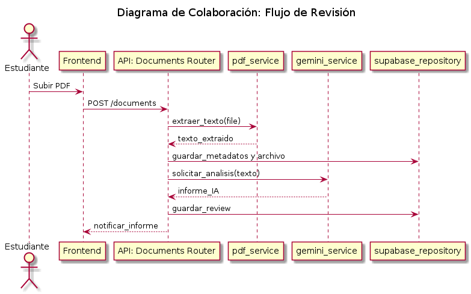
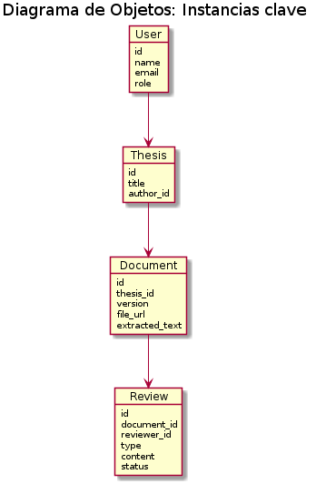
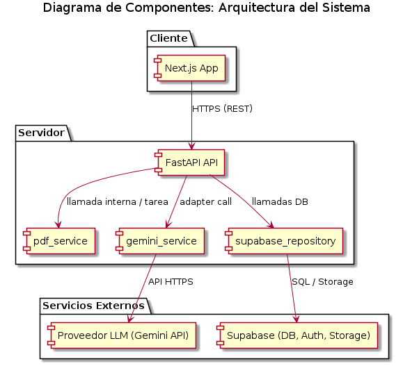
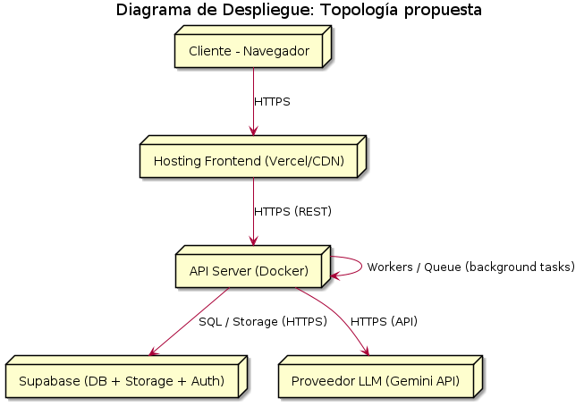

[comment]: 

**UNIVERSIDAD PRIVADA DE TACNA**

**FACULTAD DE INGENIERIA**

**Escuela Profesional de Ingeniería de Sistemas**

**Proyecto *Agente de IA para Revisión y Asesoría de Tesis***

Curso: *Patrones de Software*

Docente: *Patrick José Cuadros Quiroga*

Integrantes:

***Ayala Ramos, Carlos Daniel (2022074266)***
 
***Loyola Vilca, Renzo Fernando (2021072615)***
 
***Vargas Candia, Hashira Belén (2022075480)***

**Tacna – Perú**

***2026***

**  
**

\pagebreak

|CONTROL DE VERSIONES||||||
| :-: | :- | :- | :- | :- | :- |
|Versión|Hecha por|Revisada por|Aprobada por|Fecha|Motivo|
|1\.0|MPV|ELV|ARV|07/04/2026|Versión Original|

**Sistema *Agente de IA para Revisión y Asesoría de Tesis***

**Documento de Visión**

**Versión *{1.0}***
**

\pagebreak

|CONTROL DE VERSIONES||||||
| :-: | :- | :- | :- | :- | :- |
|Versión|Hecha por|Revisada por|Aprobada por|Fecha|Motivo|
|1\.0|MPV|ELV|ARV|10/10/2020|Versión Original|

\pagebreak

**INDICE GENERAL**
#

- [1. Introducción](#1-introducción)
	- [1.1 Propósito](#11-propósito)
	- [1.2 Alcance](#12-alcance)
	- [1.3 Definiciones, Siglas y Abreviaturas](#13-definiciones-siglas-y-abreviaturas)
	- [1.4 Referencias](#14-referencias)
	- [1.5 Visión General](#15-visión-general)
- [2. Posicionamiento](#2-posicionamiento)
	- [2.1 Oportunidad de negocio](#21-oportunidad-de-negocio)
	- [2.2 Definición del problema](#22-definición-del-problema)
- [3. Descripción de los interesados y usuarios](#3-descripción-de-los-interesados-y-usuarios)
	- [3.1 Resumen de los interesados](#31-resumen-de-los-interesados)
	- [3.2 Resumen de los usuarios](#32-resumen-de-los-usuarios)
	- [3.3 Entorno de usuario](#33-entorno-de-usuario)
	- [3.4 Perfiles de los interesados](#34-perfiles-de-los-interesados)
	- [3.5 Perfiles de los usuarios](#35-perfiles-de-los-usuarios)
	- [3.6 Necesidades de los interesados y usuarios](#36-necesidades-de-los-interesados-y-usuarios)
- [4. Vista General del Producto](#4-vista-general-del-producto)
	- [4.1 Perspectiva del producto](#41-perspectiva-del-producto)
	- [4.2 Resumen de capacidades](#42-resumen-de-capacidades)
	- [4.3 Suposiciones y dependencias](#43-suposiciones-y-dependencias)
	- [4.4 Costos y precios](#44-costos-y-precios)
	- [4.5 Licenciamiento e instalación](#45-licenciamiento-e-instalación)
- [5. Características del producto](#5-características-del-producto)
- [6. Restricciones](#6-restricciones)
- [7. Rangos de calidad](#7-rangos-de-calidad)
- [8. Precedencia y Prioridad](#8-precedencia-y-prioridad)
- [9. Otros requerimientos del producto](#9-otros-requerimientos-del-producto)
	- [9.1 Estándares legales](#91-estándares-legales)
	- [9.2 Estándares de comunicación](#92-estándares-de-comunicación)
	- [9.3 Estándares de cumplimiento de la plataforma](#93-estándares-de-cumplimiento-de-la-plataforma)
	- [9.4 Estándares de calidad y seguridad](#94-estándares-de-calidad-y-seguridad)
- [Conclusiones](#conclusiones)
- [Recomendaciones](#recomendaciones)
- [Bibliografía](#bibliografía)
- [Webgrafía](#webgrafía)
 

\pagebreak

 
**Informe de Visión**
	 SIGUE ESTA ESTRUCTURA OSEA NO HABLO DEL CONTENIDO ESO RESPETALO DE LOS DOCUMENTOS FD04 Y FD05 QUE TE ESTOY PIDIENDO Q MODIFIQUES SOLO QUIERO QUE RESPETES LA ESTRUCTURA DEL LENGUAJE MARKDOWN OSEA D COMO ESTA PUESTO EL INDICE Y ASI 

\pagebreak

## Contenido original (a partir de la sección \"INTRODUCCIÓN\")

## 1. INTRODUCCIÓN

### 1.1. Propósito (Diagrama 4+1)

Este documento describe la arquitectura de software del proyecto \"Agente Revisor IA\" siguiendo el enfoque 4+1 de vistas arquitectónicas (vistas lógico, de procesos, de implementación, de despliegue y casos de uso). Su propósito es proporcionar una referencia técnica para el equipo de desarrollo y los stakeholders, facilitando decisiones de diseño, despliegue y evolución del sistema.

### 1.2. Alcance

Se abarcan las decisiones arquitectónicas relevantes para la primera versión del producto: arquitectura cliente-servidor con frontend en Next.js, backend en FastAPI, persistencia en Supabase y componentes externos para procesamiento PDF e integración con modelos LLM (servicio `gemini_service`). Se documentan módulos, componentes, interfaces, diagramas UML existentes y requisitos de calidad.

### 1.3. Definición, siglas y abreviaturas

- API: Application Programming Interface
- LLM: Large Language Model
- PDF: Portable Document Format
- JWT: JSON Web Token
- UML: Unified Modeling Language
- RF: Requerimiento Funcional
- RNF: Requerimiento No Funcional
- IA: Inteligencia Artificial
- DB: Base de datos

### 1.4. Organización del documento

El informe sigue el índice 4+1: objetivos y restricciones, representación de la arquitectura por vistas (casos de uso, lógica, implementación, procesos, despliegue) y atributos de calidad con escenarios de validación.

## 2. OBJETIVOS Y RESTRICCIONES ARQUITECTÓNICAS

La arquitectura se diseña para soportar análisis automático de documentos académicos con integración humana en la revisión. Se priorizan modularidad, seguridad, mantenibilidad y la capacidad de sustituir el motor LLM sin reescribir la aplicación.

### 2.1.1. Requerimientos Funcionales (resumen arquitectónico)

- RF-API-01: Endpoints REST para autenticación, gestión de usuarios, documentos, revisiones y chat.
- RF-API-02: Subida y versión de documentos (soporte a PDF, metadatos y enlace a almacenamiento).
- RF-API-03: Servicio de extracción de texto y preprocesamiento (pdf_service).
- RF-API-04: Orquestador de análisis por IA (gemini_service) y persistencia de resultados.
- RF-UI-01: Vistas en frontend para carga, visualización del PDF, panel de revisión y chat.

### 2.1.2. Requerimientos No Funcionales – Atributos de Calidad

- Seguridad: autenticación y autorización por roles (Supabase Auth / JWT). Encriptación en tránsito (HTTPS).
- Disponibilidad: diseño para despliegue en entornos cloud con tolerancia a fallos básicos.
- Rendimiento: operaciones CRUD rápidas; análisis IA en background con notificaciones (asíncrono).
- Escalabilidad: componentes desacoplados (servicios PDF, IA) para escalar independientemente.
- Mantenibilidad: separación por capas (routers, services, database) y código documentado.
- Portabilidad: configuración mediante variables de entorno para entornos dev/stage/prod.

## 3. REPRESENTACIÓN DE LA ARQUITECTURA DEL SISTEMA

### 3.1. Vista de Caso de uso

Describe las interacciones externas (actores) y funcionalidades visibles:
- Actores: Estudiante, Revisor, Administrador, Servicio IA.
- Casos de uso principales: Autenticación, Subir documento, Solicitar revisión automática, Revisar observaciones, Chat de soporte, Descargar informe.

### 3.1.1. Diagramas de Casos de uso

Referencias a artefactos existentes:
- docs/diagrams/diagrama_casos_uso.puml

### 3.2. Vista Lógica

Organiza el sistema en subsistemas y módulos lógicos:
- Frontend (Next.js): componentes de UI y consumo de API.
- API Backend (FastAPI): routers, controladores y validaciones.
- Servicios de negocio: `pdf_service`, `gemini_service`, `supabase_auth_service`.
- Persistencia: repositorio Supabase (backend/app/database/supabase_repository.py).

Esta vista define las responsabilidades y contratos (JSON schemas / pydantic models en backend/app/models).

### 3.2.1. Diagrama de Subsistemas (paquetes)

Diagrama de paquetes disponible en:
- docs/diagrams/diagrama_paquetes.puml

Subsistemas principales:
1. Interfaz de usuario (frontend/components, frontend/app).
2. API y lógica de negocio (backend/app/routers, backend/app/core).
3. Servicios y adaptadores (backend/app/services).
4. Persistencia y seguridad (backend/app/database, Supabase).

### 3.2.2. Diagrama de Secuencia (vista de diseño)

Escenario: Flujo de revisión automática (resumen):
1. Frontend POST /documents -> Backend router.
2. Backend guarda metadata en Supabase y almacena archivo.
3. Backend invoca `pdf_service.extract_text()`.
4. Backend enqueue/llama a `gemini_service.analyze_text()`.
5. `gemini_service` retorna resultado estructurado.
6. Backend guarda `Review` en DB y notifica al frontend.

Diagrama referencia:
- docs/diagrams/diagrama_secuencia_revision_automatica.puml

### 3.2.3. Diagrama de Colaboración (vista de diseño)

La colaboración enfatiza mensajes y dependencias entre componentes: frontend ↔ API ↔ servicios (PDF, Gemini) ↔ DB. Este diagrama complementa la secuencia enfocándose en roles y enlaces persistentes.
Diagrama disponible en:
- docs/diagrams/diagrama_colaboracion.puml

### 3.2.4. Diagrama de Objetos

Objetos clave en runtime y su estado pasible de persistencia:
- Usuario {id, nombre, email, rol}
- Documento {id, thesis_id, version, url, estado}
- Revision {id, document_id, tipo, contenido, estado}
- Observacion {id, revision_id, texto, resuelta}
- Mensaje {id, thread_id, autor_id, texto, fecha}
Diagrama disponible en:
- docs/diagrams/diagrama_objetos.puml

### 3.2.5. Diagrama de Clases

Modelo de dominio y clases técnicas (mapa a pydantic models y repositorios). Referencia:
- docs/diagrams/diagrama_clases.puml

Clases relevantes: User, ThesisDocument, DocumentVersion, ReviewResult, PDFServiceAdapter, GeminiServiceAdapter, SupabaseRepository.

### 3.2.6. Diagrama de Base de datos (relacional o no relacional)

La solución utiliza Supabase (PostgreSQL). Tablas principales:
- users
- theses
- documents (versiones)
- reviews
- comments/messages
Diagrama disponible en:
- docs/diagrams/diagrama_componentes.puml

Esquema inicial y scripts:
- backend/sql/schema.sql

### 3.3. Vista de Implementación (vista de desarrollo)

Describe la organización del código y las dependencias internas:
- Estructura del backend: `backend/app/main.py`, `backend/app/routers/*.py`, `backend/app/services/*.py`, `backend/app/models/*.py`, `backend/app/core/*`.
- Estructura del frontend: `frontend/app/*`, `frontend/components/*`, `frontend/lib/api.js`.

Se promueve la API-first: contratos Pydantic y esquemas OpenAPI para sincronizar frontend y backend.

### 3.3.1. Diagrama de arquitectura software (paquetes)

Paquetes de desarrollo y responsabilidad:
- `routers`: definición de rutas y validaciones.
- `services`: adaptadores externos (IA, PDF, Supabase).
- `database`: repositorios y transacciones.
- `models`: pydantic y esquemas.

Referencia: docs/diagrams/diagrama_paquetes.puml

### 3.3.2. Diagrama de arquitectura del sistema (Diagrama de componentes)

Componentes desplegables (lógicos):
- Web Client (Next.js) — UI/SSG/CSR.
- API Server (FastAPI) — capa de negocio y orquestación.
- Storage (Supabase Storage) — archivos PDF.
- Database (Supabase Postgres) — datos relacionales.
- External AI Service (Gemini) — análisis LLM.

Estas piezas forman el diagrama de componentes junto con adaptadores y colas/worker si se introducen para procesamiento asíncrono.

### 3.4. Vista de procesos

Describe concurrencia y comportamiento en ejecución:
- Procesos sincronicos: autenticación, consultas CRUD, chat en tiempo real (o polling/websocket).
- Procesos asíncronos: extracción de texto y análisis IA (background jobs / tasks).

### 3.4.1. Diagrama de Procesos del sistema (diagrama de actividad)

Diagramas disponibles:
- docs/diagrams/diagrama_actividad_actual.puml
- docs/diagrams/diagrama_actividad_propuesto.puml

Actividad crítica: procesamiento de un documento (subida → extracción → análisis → persistencia → notificación).

### 3.5. Vista de Despliegue (vista física)

Topología objetivo (entorno cloud o mixto):
- Nodo cliente: navegador web.
- CDN / Vercel: hosting del frontend (Next.js) opcional.
- API Server: instancia(s) containerizada (Docker) ejecutando FastAPI.
- Supabase: servicio gestionado para DB y autenticación.
- Proveedor IA: servicios externos (API de Gemini) accesibles por HTTPS.

### 3.5.1. Diagrama de despliegue

El diagrama de despliegue debe mostrar contenedores, redes, puertos expuestos (443/HTTPS), y servicios gestionados. Mantener versión en docs/diagrams para control y revisiones.
Diagrama disponible en:
- docs/diagrams/diagrama_despliegue.puml

## 4. ATRIBUTOS DE CALIDAD DEL SOFTWARE

Se definen escenarios y métricas para validar atributos de calidad.

### Escenario de Funcionalidad

- Estímulo: Usuario solicita revisión automática.
- Artefacto: Servicio de análisis (backend + gemini_service).
- Respuesta: Generar y persistir un `ReviewResult` con observaciones.
- Métrica: Informe persistido y accesible en menos de X minutos (dependiente del proveedor IA).

### Escenario de Usabilidad

- Estímulo: Usuario no experto intenta subir y solicitar revisión.
- Respuesta: Interfaz clara, mensajes de error amigables y guía mínima.
- Métrica: Tarea completada por >90% de usuarios en pruebas de usabilidad.

### Escenario de confiabilidad

- Estímulo: Fallo momentáneo del proveedor IA.
- Respuesta: Retries controlados, colas o fallback informando al usuario.
- Métrica: Sin pérdida de datos; reintento automático y registro de incidentes.

### Escenario de rendimiento

- Estímulo: 50 usuarios concurrentes realizando operaciones mixtas.
- Respuesta: Endpoints CRUD <2s promedio; análisis IA en background sin bloquear la API.
- Métrica: P95 de latencias dentro de umbrales acordados.

### Escenario de mantenibilidad

- Estímulo: Reemplazo del adaptador LLM.
- Respuesta: Cambiar implementación en `backend/app/services/gemini_service.py` y tests pasar.
- Métrica: Tiempo de cambio reducido y cobertura de pruebas automatizadas.

### Otros Escenarios

- Seguridad: Acceso no autorizado -> Denegado y auditado.
- Escalabilidad: Aumento volumétrico -> escalar instancias API y workers.
- Portabilidad: Despliegue en otro proveedor cloud mediante variables de entorno.

---

Referencias:
- Código fuente backend: backend/app
- Código fuente frontend: frontend/app y frontend/components
- Diagrama de paquetes: docs/diagrams/diagrama_paquetes.puml
- Diagrama de secuencia de revisión: docs/diagrams/diagrama_secuencia_revision_automatica.puml
- Esquema de BD: backend/sql/schema.sql

Documento generado para alinear la implementación con la arquitectura propuesta.
